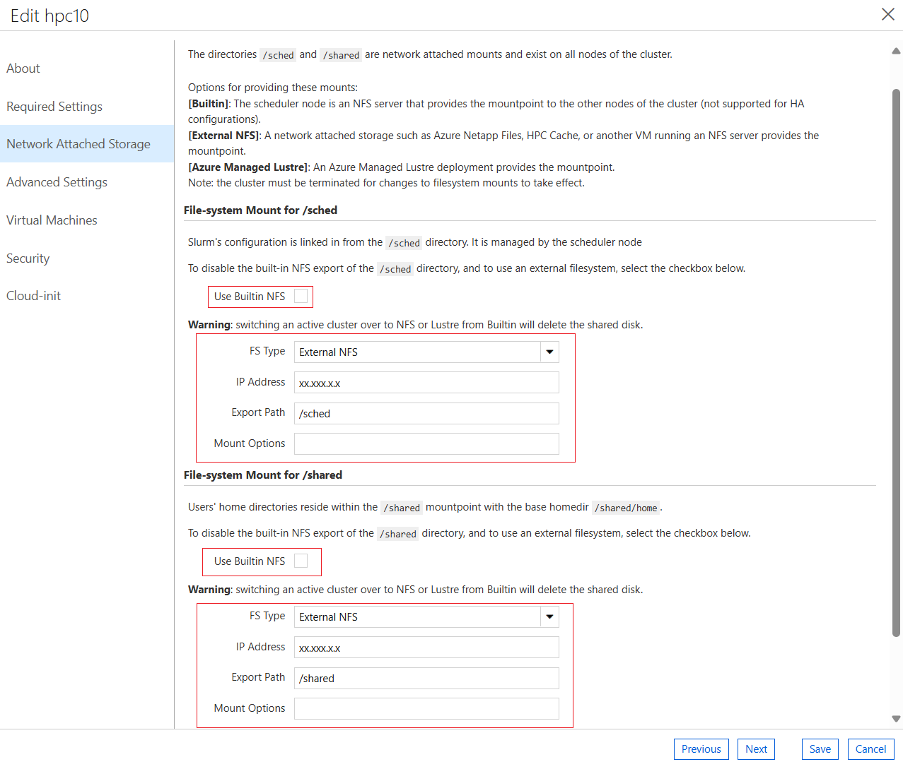
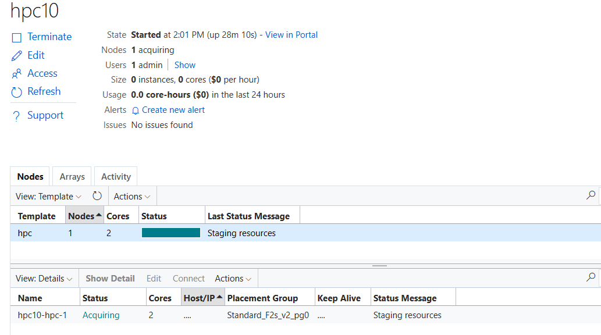

# Slurm Cloud Bursting Using CycleCloud

This repository provides detailed instructions and scripts for setting up Slurm bursting using CycleCloud on Microsoft Azure, allowing you to seamlessly scale your Slurm cluster into the cloud for additional compute resources.

## Overview

Slurm bursting enables the extension of your on-premises Slurm cluster into Azure for flexible and scalable compute capacity. CycleCloud simplifies the management and provisioning of cloud resources, bridging your local infrastructure with cloud environments.

## Requirements

Ensure you have the following prerequisites in place:

- **OS Version**: AlmaLinux HPC & Ubuntu HPC
- **CycleCloud Version**: 8.x
- **cyclecloud-slurm Project**: 3.0.x

## Setup Instructions

### 1. On CycleCloud VM:


- Ensure CycleCloud VM is running and accessible via `cyclecloud` CLI.
- Clone this repository and run the `sh 01_prep_cyclecloud-slurm_template.sh` script in the cyclecloud directory.
- `sh 01_prep_cyclecloud-slurm_template.sh` give the CycleCloud project version, Slurm version and cyclecloud-slurm template to build the Cloud busting setup.

```bash
git clone https://github.com/vinil-v/slurm-cloud-bursting-using-cyclecloud.git
cd slurm-cloud-bursting-using-cyclecloud/cyclecloud/
sh 01_prep_cyclecloud-slurm_template.sh
```

Output :

```bash
[vinil@ccvm cyclecloud]$ sh 01_prep_cyclecloud-slurm_template.sh 
Project version: 3.0.10
Slurm version:  24.05.4-2
Template location : slurm-3.0.10/templates/slurm-headless.txt
Please refer README for customizing the template for Headless Slurm cluster
[vinil@ccvm cyclecloud]$ 
```
This above output shows the Cyclecloud-Slurm Project version available in your cyclecloud enviorment, supported slurm version in the project and the template for creating headless slurm cluster.

- Edit the template from the given template location (`Template location : slurm-3.0.10/templates/slurm-headless.txt`) using your favorite edior and make the following adjustment to create a headless template.
    - Update the [cluster Slurm] to [cluster Slurm_HL] for refering as a Headless Cluster template.
    - Remove the following sections completely in the template to prepare a headless template.

        ```bash
        slurm.ha_enabled = $configuration_slurm_ha_enabled
        [[node scheduler]]
        [[nodearray scheduler-ha]]
        [[nodearray login]]
        [[[parameter SchedulerMachineType]]]
        [[[parameter loginMachineType]]]
        [[[parameter NumberLoginNodes]]]
        [[parameters High Availability]]
        [[[parameter configuration_slurm_ha_enabled]]]
        [[[parameter SchedulerHostName]]]
        [[[parameter SchedulerImageName]]]
        [[[parameter SchedulerClusterInitSpecs]]]
        [[[parameter SchedulerZone]]]
        [[[parameter SchedulerHAZone]]]
        ```
- Once the headless template is prepared then run `sh 02_cyclecloud_build_cluster.sh` script to import the headless cluster to cyclecloud.
```bash
sh 02_cyclecloud_build_cluster.sh
```
Output:
```bash

[vinil@ccvm cyclecloud]$ sh 02_cyclecloud_build_cluster.sh 
Enter Cluster Name: hpc10
Cluster Name: hpc10
Importing Cluster
Importing cluster Slurm_HL and creating cluster hpc10....
-----------
hpc10 : off
-----------
Resource group: 
Cluster nodes:
Total nodes: 0
Cluster Name: hpc10
Project version: 3.0.10
Slurm version:  24.05.4-2
[vinil@ccvm cyclecloud]$ 
```
please make a note of the Cluster Name, Project version and Slurm version. which you will be using the next steps.


### 2. Preparing Scheduler VM:

- Deploy a VM using the specified AlmaLinux image (If you have an existing Slurm Scheduler, you can skip this).
- Run the Slurm scheduler installation script (`sh 01_slurm-scheduler-builder.sh`) and provide the cluster name and the slurm version when prompted.
- Cluster Name and Slurm version should be same taken from the previous step.
- This script will install and configure Slurm Scheduler.

```bash
git clone https://github.com/vinil-v/slurm-cloud-bursting-using-cyclecloud.git
cd  slurm-cloud-bursting-using-cyclecloud/scheduler/
sh 01_slurm-scheduler-builder.sh
```
Output 

```bash
[root@scheduler scheduler]# sh 01_slurm-scheduler-builder.sh 
------------------------------------------------------------------------------------------------------------------------------
Building Slurm scheduler for cloud bursting with Azure CycleCloud
------------------------------------------------------------------------------------------------------------------------------
 
Enter Cluster Name: hpc10
Enter the Slurm version to install (You get this from the cyclecloud_build_cluster.sh): 24.05.4-2                                            
------------------------------------------------------------------------------------------------------------------------------
 
Summary of entered details:
--------------------------
Cluster Name: hpc10
Scheduler Hostname: scheduler
NFS Server IP Address: XX.XXX.X.X
 
 Please Note down the above details for configuring cyclecloud UI
------------------------------------------------------------------------------------------------------------------------------
------------------------------------------------------------------------------------------------------------------------------
Creating Munge and Slurm users
------------------------------------------------------------------------------------------------------------------------------
Munge and Slurm users created
------------------------------------------------------------------------------------------------------------------------------
Setting up NFS server
------------------------------------------------------------------------------------------------------------------------------
<--- truncated output --->
------------------------------------------------------------------------------------------------------------------------------
Slurm installed
------------------------------------------------------------------------------------------------------------------------------
------------------------------------------------------------------------------------------------------------------------------
Configuring Slurm
------------------------------------------------------------------------------------------------------------------------------
 
------------------------------------------------------------------------------------------------------------------------------
Slurm configured
------------------------------------------------------------------------------------------------------------------------------
 
------------------------------------------------------------------------------------------------------------------------------
 Go to CycleCloud Portal and edit the hpc10 cluster configuration to use the external scheduler and start the cluster.
 Use XX.XXX.X.X IP Address for File-system Mount for /sched and /shared in Network Attached Storage section in CycleCloud GUI 
 Once the cluster is started, proceed to run  cyclecloud-integrator.sh script to complete the integration with CycleCloud.
------------------------------------------------------------------------------------------------------------------------------
 
```

### 3. CycleCloud UI:

- Access the CycleCloud UI, edit the `hpc10` cluster settings, and configure VM SKUs and networking settings.
- Enter the NFS server IP address for `/sched` and `/shared` mounts in the Network Attached Storage section.
- Save & Start `hpc10` cluster



### 4. On Slurm Scheduler Node:

- Integrate Slurm with CycleCloud using the `cyclecloud-integrator.sh` script.
- Provide CycleCloud details (username, password, and URL) when prompted.

```bash
cd slurm-cloud-bursting-using-cyclecloud/scripts
sh cyclecloud-integrator.sh
```
Output:

```bash
[root@masternode2 scripts]# sh cyclecloud-integrator.sh
Please enter the CycleCloud details to integrate with the Slurm scheduler

Enter Cluster Name: hpc1
Enter CycleCloud Username: vinil
Enter CycleCloud Password:
Enter CycleCloud URL (e.g., https://10.222.1.19): https://10.222.1.19
------------------------------------------------------------------------------------------------------------------------------

Summary of entered details:
Cluster Name: hpc1
CycleCloud Username: vinil
CycleCloud URL: https://10.222.1.19

------------------------------------------------------------------------------------------------------------------------------
```

### 5. User and Group Setup:

- Ensure consistent user and group IDs across all nodes.
- Better to use a centralized User Management system like LDAP to ensure the UID and GID are consistent across all the nodes.
- In this example we are using the `users.sh` script to create a test user `vinil` and group for job submission. (User `vinil` is exist in CycleCloud)

```bash
cd slurm-cloud-bursting-using-cyclecloud/scripts
sh users.sh
```

### 6. Testing & Job Submission:

- Log in as a test user (`vinil` in this example) on the Scheduler node.
- Submit a test job to verify the setup.

```bash
su - vinil
srun hostname &
```
Output:
```bash
[root@masternode2 scripts]# su - vinil
Last login: Tue May 14 04:54:51 UTC 2024 on pts/0
[vinil@masternode2 ~]$ srun hostname &
[1] 43448
[vinil@masternode2 ~]$ squeue
             JOBID PARTITION     NAME     USER ST       TIME  NODES NODELIST(REASON)
                 1       hpc hostname    vinil CF       0:04      1 hpc1-hpc-1
[vinil@masternode2 ~]$ hpc1-hpc-1
```


You should see the job running successfully, indicating a successful integration with CycleCloud.

For further details and advanced configurations, refer to the scripts and documentation within this repository.

---

These instructions provide a comprehensive guide for setting up Slurm bursting with CycleCloud on Azure. If you encounter any issues or have questions, please refer to the provided scripts and documentation for troubleshooting steps. Happy bursting!
