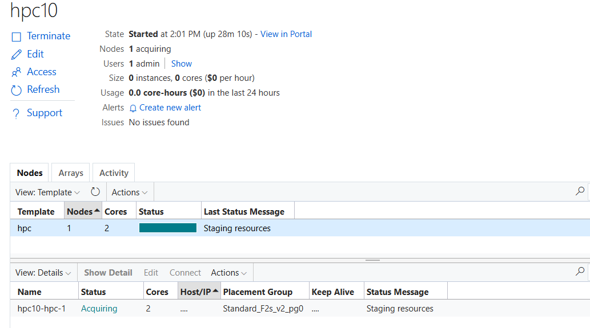

# Slurm Cloud Bursting Using CycleCloud

This repository provides detailed instructions and scripts for setting up Slurm bursting using CycleCloud on Microsoft Azure, allowing you to seamlessly scale your Slurm cluster into the cloud for additional compute resources.

## Overview

Slurm bursting enables the extension of your on-premises Slurm cluster into Azure for flexible and scalable compute capacity. CycleCloud simplifies the management and provisioning of cloud resources, bridging your local infrastructure with cloud environments.

## Requirements

Ensure you have the following prerequisites in place:

- **OS Version**: AlmaLinux release 8.7 (`almalinux:almalinux-hpc:8_7-hpc-gen2:latest`)
- **Slurm Version**: 23.11.9-1
- **cyclecloud-slurm Project**: 3.0.9
- **CycleCloud Version**: 8.6.4-3320

## Setup Instructions

### 1. On CycleCloud VM:

- Ensure CycleCloud 8.6.4 VM is running and accessible via `cyclecloud` CLI.
- Execute the `cyclecloud-project-build.sh` script and provide the cluster name (`hpc1`) this will setup and custom project based on `cyclecloud-slurum-3.0.9` and import the cluster the headless template.

```bash
git clone https://github.com/user1-v/slurm-cloud-bursting-using-cyclecloud.git
cd slurm-cloud-bursting-using-cyclecloud/slurm-23.11.9-1/cyclecloud
sh cyclecloud-project-build.sh
```

Output :

```bash
[user1@cc86vm ~]$ git clone https://github.com/user1-v/slurm-cloud-bursting-using-cyclecloud.git
Cloning into 'slurm-cloud-bursting-using-cyclecloud'...
remote: Enumerating objects: 239, done.
remote: Counting objects: 100% (239/239), done.
remote: Compressing objects: 100% (168/168), done.
remote: Total 239 (delta 137), reused 167 (delta 67), pack-reused 0 (from 0)
Receiving objects: 100% (239/239), 205.17 KiB | 2.14 MiB/s, done.
Resolving deltas: 100% (137/137), done.
[user1@cc86vm ~]$ cd slurm-cloud-bursting-using-cyclecloud/slurm-23.11.9-1/cyclecloud/
[user1@cc86vm cyclecloud]$ sh cyclecloud-project-build.sh
Enter Cluster Name: hpc1
Cluster Name: hpc1
Use the same cluster name: hpc1 in building the scheduler
Importing Cluster
Importing cluster Slurm_HL and creating cluster hpc1....
----------
hpc1 : off
----------
Resource group:
Cluster nodes:
Total nodes: 0
Locker Name: HPC+AI storage
Fetching CycleCloud project
Uploading CycleCloud project to the locker
```

### 2. Preparing Scheduler VM:

- Deploy a VM using the specified AlmaLinux image (If you have an existing Slurm Scheduler, you can skip this).
- Run the Slurm scheduler installation script (`slurm-scheduler-builder.sh`) and provide the cluster name (`hpc1`) when prompted.
- This script will install and configure Slurm Scheduler.

```bash
git clone https://github.com/user1-v/slurm-cloud-bursting-using-cyclecloud.git
cd slurm-cloud-bursting-using-cyclecloud/slurm-23.11.9-1/ext-scheduler
sh slurm-scheduler-builder.sh
```
Output 

```bash
------------------------------------------------------------------------------------------------------------------------------
Building Slurm scheduler for cloud bursting with Azure CycleCloud
------------------------------------------------------------------------------------------------------------------------------

Enter Cluster Name: hpc1
------------------------------------------------------------------------------------------------------------------------------

Summary of entered details:
Cluster Name: hpc1
Scheduler Hostname: masternode2
NFSServer IP Address: 10.222.1.26
```

### 3. CycleCloud UI:

- Access the CycleCloud UI, edit the `hpc1` cluster settings, and configure VM SKUs and networking settings.
- Enter the NFS server IP address for `/sched` and `/shared` mounts in the Network Attached Storage section.
- Save & Start `hpc1` cluster


### 4. On Slurm Scheduler Node:

- Integrate Slurm with CycleCloud using the `cyclecloud-integrator.sh` script.
- Provide CycleCloud details (username, password, and URL) when prompted.

```bash
cd slurm-cloud-bursting-using-cyclecloud/slurm-23.11.9-1/ext-scheduler
sh cyclecloud-integrator.sh
```
Output:

```bash
[root@masternode2 scripts]# sh cyclecloud-integrator.sh
Please enter the CycleCloud details to integrate with the Slurm scheduler

Enter Cluster Name: hpc1
Enter CycleCloud Username: user1
Enter CycleCloud Password:
Enter CycleCloud IP (e.g., 10.222.1.19): 10.222.1.19
------------------------------------------------------------------------------------------------------------------------------

Summary of entered details:
Cluster Name: hpc1
CycleCloud Username: user1
CycleCloud URL: https://10.222.1.19

------------------------------------------------------------------------------------------------------------------------------
```

### 5. User and Group Setup:

- Ensure consistent user and group IDs across all nodes.
- Better to use a centralized User Management system like LDAP to ensure the UID and GID are consistent across all the nodes.
- In this example we are using the `useradd_example.sh` script to create a test user `user1` and group for job submission. (User `user1` is exist in CycleCloud)

```bash
cd cd slurm-cloud-bursting-using-cyclecloud/slurm-23.11.9-1/ext-scheduler
sh useradd_example.sh
```

### 6. Testing & Job Submission:

- Log in as a test user (`user1` in this example) on the Scheduler node.
- Submit a test job to verify the setup.

```bash
su - user1
srun hostname &
```
Output:
```bash
[root@masternode2 scripts]# su - user1
Last login: Tue May 14 04:54:51 UTC 2024 on pts/0
[user1@masternode2 ~]$ srun hostname &
[1] 43448
[user1@masternode2 ~]$ squeue
             JOBID PARTITION     NAME     USER ST       TIME  NODES NODELIST(REASON)
                 1       hpc hostname    user1 CF       0:04      1 hpc1-hpc-1
[user1@masternode2 ~]$ hpc1-hpc-1
```


You should see the job running successfully, indicating a successful integration with CycleCloud.

For further details and advanced configurations, refer to the scripts and documentation within this repository.

---

These instructions provide a comprehensive guide for setting up Slurm bursting with CycleCloud on Azure. If you encounter any issues or have questions, please refer to the provided scripts and documentation for troubleshooting steps. Happy bursting!
